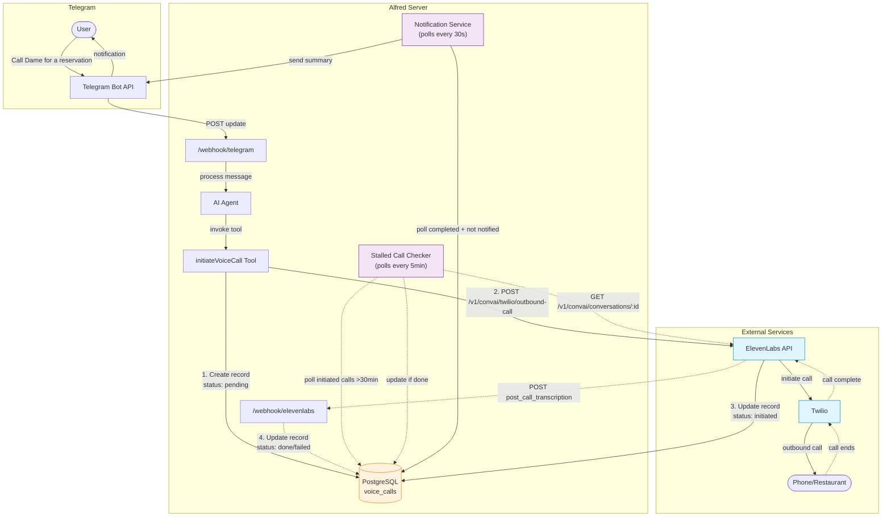

# Voice Call Flow

This document describes the complete flow of AI-powered phone calls from user request through completion notification.

## Architecture Overview



## Flow Description

### 1. User Request

User sends a message to the Telegram bot requesting a phone call:
> "Call Dame for a reservation tonight at 7pm for 2 people"

### 2. Agent Processing

The AI agent (`src/agent/index.ts`) analyzes the request and determines it needs to make a phone call. It invokes the `initiateVoiceCall` tool with:

- `agentType`: "restaurant" | "medical" | "general"
- `callPurpose`: "reservation" | "confirmation" | "inquiry" | etc.
- `toNumber`: Phone number in E.164 format (+15551234567)
- `toName`: "Dame"
- `instructions`: Detailed instructions for the AI caller

### 3. Call Initiation

The voice call tool (`src/agent/tools/voice-calls.ts`):

1. **Creates DB record** with status `pending`
2. **Calls ElevenLabs API** at `POST /v1/convai/twilio/outbound-call`
3. **Updates DB record** with `conversation_id` and status `initiated`
4. **Returns confirmation** to the agent

```typescript
// Request to ElevenLabs
{
  agent_id: "agent_xxx",           // From env var based on agentType
  agent_phone_number_id: "xxx",    // ELEVENLABS_PHONE_NUMBER_ID
  to_number: "+15551234567",
  conversation_initiation_client_data: {
    user_id: "user-uuid",
    dynamic_variables: {
      user_name: "Blake",
      call_instructions: "Book a table for 2...",
      recipient_name: "Dame",
      callback_number: "+15559876543"  // User's phone for callbacks
    }
  }
}
```

### 4. Call Execution

ElevenLabs orchestrates the call via Twilio:

1. Twilio places outbound call to the restaurant
2. ElevenLabs AI agent handles the conversation
3. Call completes (success, voicemail, no answer, or failure)

### 5. Completion Webhook (Primary Path)

When the call ends, ElevenLabs sends a webhook to `/webhook/elevenlabs`:

```typescript
// Webhook payload
{
  type: "post_call_transcription",
  data: {
    conversation_id: "conv_xxx",
    status: "done",
    transcript: [...],
    metadata: {
      call_duration_secs: 120,
      termination_reason: "Call ended by remote party"
    },
    analysis: {
      call_successful: "success",
      transcript_summary: "Successfully booked table for 2 at 7pm..."
    }
  }
}
```

The webhook handler (`src/webhooks/elevenlabs.ts`):
1. Validates HMAC signature
2. Looks up call by `conversation_id`
3. Updates DB with transcript, summary, outcome, duration

### 6. Stalled Call Recovery (Fallback Path)

If the webhook fails, a background service polls for stalled calls:

- Runs every 5 minutes
- Finds calls in `initiated` status older than 30 minutes
- Polls ElevenLabs API for current status
- Updates DB if call is complete

### 7. User Notification

A notification service (`src/services/voice-call-notifications.ts`):

- Polls every 30 seconds for completed calls not yet notified
- Formats a summary message with outcome, duration, and transcript summary
- Sends to the couple's Telegram group
- Marks call as notified

Example notification:
```
Call Complete: Dame

Result: Successful
Duration: 2m 1s

Summary:
Successfully booked a table for 2 at 7pm on Tuesday, January 6th.
The reservation is under the name Blake.

Requested by Blake
```

## Database Schema

```sql
CREATE TABLE voice_calls (
  id UUID PRIMARY KEY DEFAULT gen_random_uuid(),
  couple_id UUID NOT NULL REFERENCES couples(id),
  initiated_by UUID NOT NULL REFERENCES users(id),

  -- ElevenLabs identifiers
  conversation_id TEXT UNIQUE,
  call_sid TEXT,

  -- Call details
  agent_type TEXT NOT NULL DEFAULT 'general',  -- restaurant, medical, general
  call_purpose TEXT NOT NULL,                   -- reservation, confirmation, etc.
  to_number TEXT NOT NULL,
  to_name TEXT,
  instructions TEXT NOT NULL,
  dynamic_variables JSONB,

  -- Status tracking
  status TEXT NOT NULL DEFAULT 'pending',  -- pending, initiated, in-progress, done, failed

  -- Results (populated after completion)
  transcript JSONB,
  summary TEXT,
  outcome TEXT,  -- success, failure, voicemail, no_answer, unknown
  call_duration_secs INTEGER,
  termination_reason TEXT,
  error_code TEXT,
  error_reason TEXT,

  -- Timestamps
  created_at TIMESTAMPTZ DEFAULT now(),
  started_at TIMESTAMPTZ,
  completed_at TIMESTAMPTZ,
  notified_at TIMESTAMPTZ
);
```

## Environment Variables

| Variable | Description |
|----------|-------------|
| `ELEVENLABS_API_KEY` | API key for ElevenLabs |
| `ELEVENLABS_PHONE_NUMBER_ID` | Twilio phone number ID registered with ElevenLabs |
| `ELEVENLABS_WEBHOOK_SECRET` | Secret for validating webhook signatures |
| `ELEVENLABS_AGENT_RESTAURANT` | Agent ID for restaurant calls |
| `ELEVENLABS_AGENT_MEDICAL` | Agent ID for medical calls |
| `ELEVENLABS_AGENT_GENERAL` | Agent ID for general calls |
| `ELEVENLABS_AGENT_ID` | Legacy fallback agent ID |

## Error Handling

### Common Failure Points

1. **Invalid phone number**: Tool validates E.164 format before calling API
2. **Missing agent**: 404 error if agent ID doesn't exist in ElevenLabs
3. **Webhook failure**: Stalled call checker recovers after 30 minutes
4. **No Telegram group**: Notification skipped (call still works)

### Status Flow

```
pending → initiated → in-progress → done
                   ↘              ↗
                     → failed →
```

## Files Reference

| File | Purpose |
|------|---------|
| `src/agent/tools/voice-calls.ts` | Tool definition and call initiation |
| `src/integrations/elevenlabs.ts` | ElevenLabs API client |
| `src/webhooks/elevenlabs.ts` | Webhook handler for call completion |
| `src/services/voice-call-notifications.ts` | Telegram notification service |
| `src/db/queries/voice-calls.ts` | Database queries |
